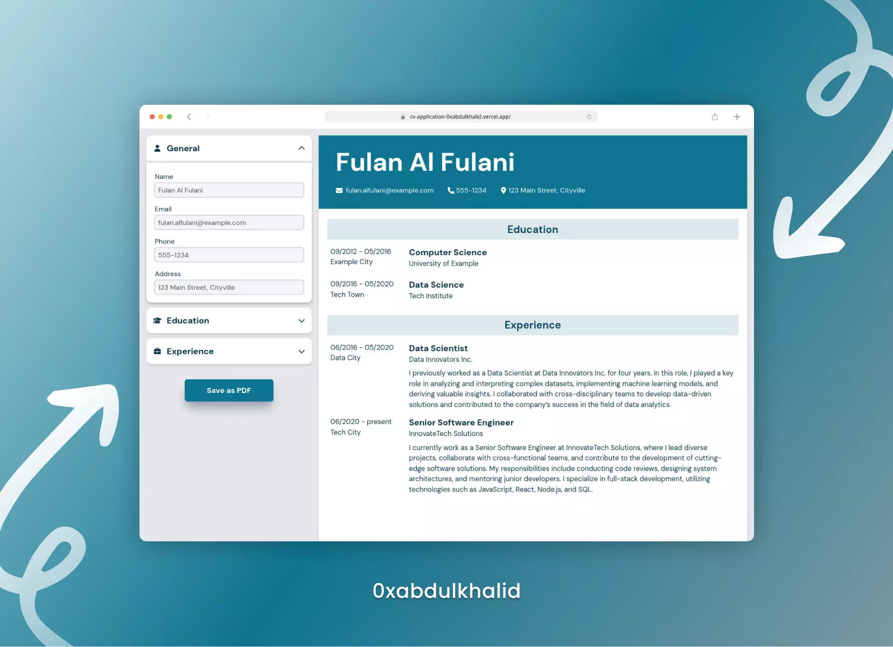

<br>
<div align="center">
<picture>
    <source media="(prefers-color-scheme: light)" srcset="https://readme-typing-svg.herokuapp.com?font=Space+Grotesk&weight=600&size=40&pause=&color=000&center=true&vCenter=true&repeat=false&random=false&width=280&height=60&lines=CV%20Application">
    
  </picture>
<br>

**❝** Get your CV done fast and hassle-free with our intuitive tool **❞**

<br>
  <p>
    ❯ &nbsp;
    <a href="https://cv-application-0xabdulkhalid.vercel.app/">View Demo</a>
    &nbsp;·&nbsp;
    <a href="https://github.com/0xabdulkhalid/cv-application/issues">Report Bug</a>
    &nbsp;·&nbsp;
    <a href="https://github.com/0xabdulkhalid/cv-application/issues">Request Feature</a>
     &nbsp; ❮
  </p>
</div>

<br>

<div align='center'>

</div>

<br>

## Project Overview

- The CV Application was primarily developed to gain a better understanding of React fundamentals.

- Building this application enabled me to learn about State Management, React Hooks, and leverage Vite's features for deploying production-ready applications.

- Considered a warm-up project, I focused on the core concepts and did not delve into intricate details, such as the implementation of the Header and Footer.

- Developed as part of the partial completion of the Odin Project's Full-Stack JavaScript Path.

- Since this was my initial experience with React, the code quality may not be optimal. However, I am committed to refining my coding practices through continuous practice and building more applications with React.


<br>

## Installation

> [!NOTE]  
> If you prefer not to install it locally, you can also access the [live demo](https://cv-application-0xabdulkhalid.vercel.app/) version

To set up the CV Application locally, follow these steps:

1. Clone the GitHub repository to your local machine:

   ```bash
   git clone https://github.com/0xabdulkhalid/cv-application.git
   ```

2. Navigate to the project's directory:

   ```bash
   cd cv-application
   ```

3. Install the project's dependencies using npm:

   ```bash
   npm install
   ```

4. Building the source for Production using Vite:

   ```bash
   npm run build
   ```

5. The build files can be found on `dist` (distribution) directory.

<br>

## Pagespeed Insights Score
  
- ||
  | :-----: |
  |  <b>Overall Score 99.3%, Average of Mobile and Desktop</b><br>[ Mobile devices score is only shown below ] |
  | |
  |  |
  | |
  | Check out [**Pagespeed Insights**](https://pagespeed.web.dev/analysis/https-cv-application-0xabdulkhalid-vercel-app/02v5pjdoui?form_factor=mobile) to get live score |
  ||

<br>

## Built With

<div align=center>

 &nbsp;&nbsp; 

</div>

<br>

## Tools Used

<div align=center>
  
 &nbsp;&nbsp; &nbsp;&nbsp; &nbsp;&nbsp; &nbsp;&nbsp;

&nbsp;&nbsp; &nbsp;&nbsp; &nbsp;&nbsp; 

</div>

<br>

## Let's Connect 👋

<div align=center>

  <a href="https://linkedin.com/in/0xabdulkhalid" >
    
  </a>&nbsp;&nbsp;

  <a href="mailto:0xabdulkhalid@gmail.com" target="_blank">
    
  </a>&nbsp;&nbsp;

  <a href="https://www.github.com/0xabdulkhalid/" >
    
  </a>

</div>

<br>
